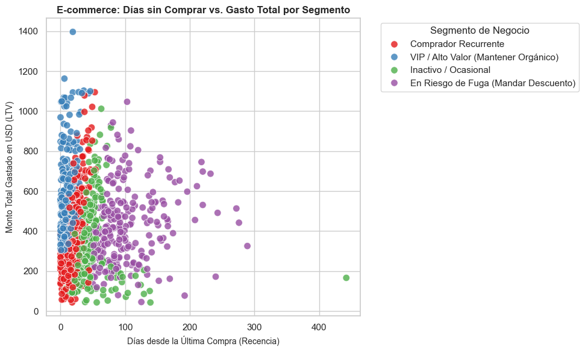

# transacciones_del_e-commerce
# Detección de anomalías y fraude bancario/e-commerce sobre 284,807 transacciones reales utilizando Random Forest y calibración de umbrales.
# 🛡️ 03. Real-Time E-Commerce & Financial Fraud Detection

## 📌 Executive Summary
High-impact risk management project focused on detecting credit card fraud in highly imbalanced transactional environments (284,807 real transactions from ULB Machine Learning Group benchmark, with a 0.172% positive fraud rate).

## 🎯 Business Challenge
In real-world financial systems, standard accuracy is misleading (a naive model declaring all transactions legitimate reaches 99.83% accuracy while failing 100% of fraud cases). The priority is maximizing **Recall** (capturing fraud) while managing **False Positives** (customer friction).

## 🛠️ Methodology & Modeling
- **Dataset:** 284,807 real PCA-transformed European card transactions.
- **Algorithm:** `RandomForestClassifier` with class weight balancing (`class_weight='balanced'`) and stratified sampling.
- **Decision Threshold Calibration:** Shifted decision boundary from default 0.50 down to 0.15 / 0.05 to optimize fraud recall.

## 📈 Key Results
- **Fraud Capture Rate (Recall):** Successfully detected **90.8% of fraudulent transactions** on unseen test data.
- **Operational Strategy:** Routed suspicious transactions (5% threshold) to 2FA / SMS verification instead of hard blocks, protecting user experience while mitigating financial loss.

## 🚀 Tech Stack
- **Python 3.14:** Pandas, NumPy, Scikit-Learn, Matplotlib, Seaborn

